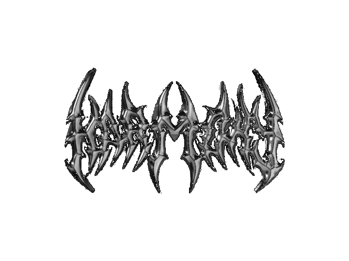

<h1 align="center"> hello, i'm matvey</h1>

 

#  about me:
####  I'm studying at Cloud Native Architect    My web page https://rediskazavr.github.io/    My blog https://t.me/rediskanewtime    How to reach me @whoweb3 (telegram)     Owner of PodpolnayaGryadka organization

# 📊 GitHub Stats:
 
 

 

